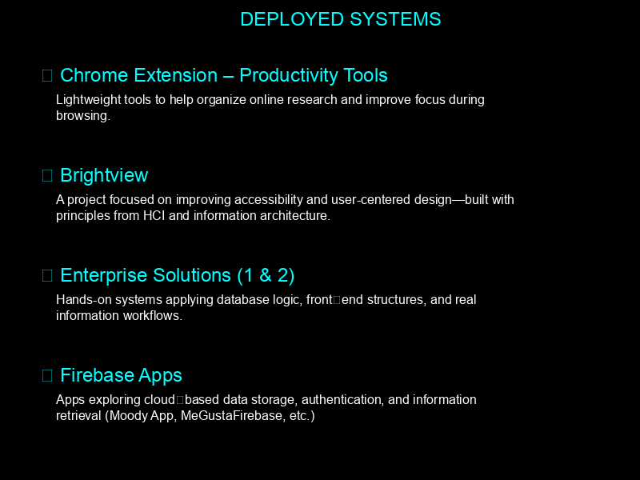

  
   
  <h1>⚡ SYSTEM ONLINE: MARCOS GALDAMEZ ⚡</h1>
  <h3>[ Information Science Operative | Code Architect | Research Unit ]</h3>

  <samp>
    > LOCATION: Tampa, FL 
    > AFFILIATION: USF 
    > MISSION: Information Behavior, Database Security, HCI 
    > STATUS: Active
  </samp>

  
   
  <samp>> ACCESS FULL DOSSIER & PROJECTS</samp>
    

  
   
  <samp>> INITIATE SECURE COMMUNICATION</samp>
    

  
   
  <samp>> ESTABLISH PROFESSIONAL UPLINK</samp>

## 🧬 LOADED MODULES (Languages & Tools)

  
  
  
  
  
  

## 💾 DEPLOYED SYSTEMS (Projects)

  

## 📊 SYSTEM DIAGNOSTICS (Stats)

   
   
  

